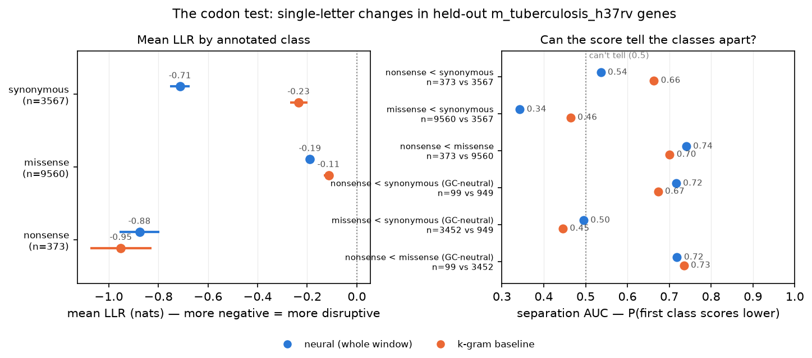
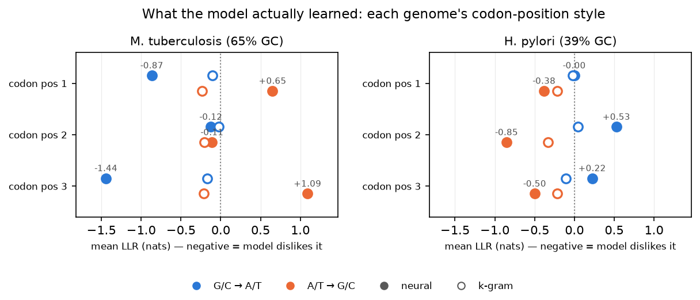

# The Variant Detective

*Part 10 of a series on teaching an AI to read DNA. Last post, the model learned to say whether a sequence looks like real DNA. This post asks the sharper question from Post 1: I changed one letter. Did I just break something? The detective I built mostly works. The more interesting part is who it turned out to be investigating.*

---

Post 1 opened with the idea that a single letter can matter. Swap one base in the wrong place and a protein comes out truncated, or folds wrong, or never gets made. That's the version of "reading DNA" that people actually care about. Nobody's life changes because a model scored a genome at 1.89 bits per base. Plenty of lives change because of one letter.

My model has been able to put a number on a single-letter change since the very first version. `variant_effect` swaps the base, rescores the window around it, and returns the difference: a **log-likelihood ratio**, or LLR. Negative means the model finds the changed sequence less likely than the original. The tool then helpfully added a one-word verdict: *negative → "more disruptive."*

That verdict was a lie, and it took me nine posts to notice.

## The trap: almost everything is "disruptive"

Think about what the model has been trained to do. It has read tens of millions of letters of real bacterial DNA and learned to expect what real DNA does next. So when I show it a real sequence and then a copy with one letter changed, which one will it usually prefer? **The real one, obviously.** The real one is what DNA looks like, and almost any edit is a small step away from it.

I measured this on 13,500 single-letter changes in real genes from *M. tuberculosis*, a genome the model never trained on. The old rule ("negative LLR = disruptive") flagged **65% of all of them**, including **74% of synonymous changes**. Synonymous changes swap a letter without changing the protein at all; they're the textbook example of a *harmless* mutation. A detective who arrests three out of every four innocent bystanders isn't detecting anything.

It's the Part 9 trap in a new costume. There, a low score could be flattering for the wrong reason. Here, a negative LLR is almost guaranteed, so its sign carries almost no information. Just like in Part 9, the fix is to stop asking an absolute question and start asking a relative one.

## The fix: compare it to its neighbors

The honest question isn't "does this change make the sequence less likely?" (nearly everything does). It's **"is this change more surprising than the other changes the model could have seen right here?"**

So the new tool, `dna_variant_report`, lines the variant up against its own local background. It scores **every other single-letter substitution within 30 bases on either side** (about 180 of them, all run through the model in one batch), and then reports where the variant ranks:

> **disruption_percentile** = the fraction of nearby single-letter changes that this one is *more* disruptive than.

If a change beats 95% of its neighbors, the model is genuinely singling it out. If it lands in the middle of the pack, it's just the usual cost of editing real DNA. That gives three verdicts: `likely_disruptive` (≥ 90th percentile), `uncertain`, and `likely_tolerated`. As in Part 9, the model is judging against its own control, with no magic threshold on raw nats.

There's also a fourth verdict, borrowed straight from Part 9. Before judging a variant, the tool runs the *surrounding* DNA through last post's score check. If the model can't read that region at all (it looks `random_like` or repetitive), the answer is **`unreliable_context`**. You can't meaningfully "disrupt" grammar the model doesn't see there, so the tool says *I can't judge* instead of guessing confidently.

Building this also turned up a small, real bug. The old `variant_effect` computed its total by multiplying an *average* by the window length, and that was off by one token. The error was tiny (a constant fraction of a percent), but it was wrong, and "almost right" isn't a standard this series accepts. The new batched version sums the exact log-probabilities, and a test checks it against a hand-computed forward pass.

## Ground truth: let the genetic code grade the detective

A calibrated verdict is nice, but calibrated against *what*? I needed a test where I know the right answer without asking the model. It turns out biology already hands us one, for free, inside every gene.

Genes are read three letters at a time. Each three-letter **codon** means one amino acid, or "stop." That lets you sort any single-letter change inside a gene into one of three kinds, just by looking it up in the genetic code:

- **Synonymous**: the codon changes but still means the same amino acid, so the protein is untouched.
- **Missense**: the codon now means a *different* amino acid, so the protein has one changed brick.
- **Nonsense**: the codon becomes **stop**, so the protein is cut off mid-sentence.

Evolution tolerates these in roughly that order. So if the model has learned anything about how genes work, it should rank them **nonsense < missense < synonymous**.

I downloaded NCBI's gene annotations for my two held-out genomes (*M. tuberculosis* and *H. pylori*) and parsed them conservatively. I keep only plain, complete, single-piece genes, because one wrong reading frame would mislabel every variant inside it. As a sanity check, all 3,906 kept *M. tuberculosis* genes end in a stop codon, and none has a stop in the middle. Then I sampled 1,500 random codons, tried all 9 possible single-letter changes at each, and scored every one.

Each change got two scores: my neural model's, and an **order-5 k-gram's**. The k-gram is the humble letter-counter from Part 2 that the neural net has to beat to justify existing. And instead of eyeballing averages, I report one number per comparison, the **separation AUC**: the chance that a randomly chosen nonsense change scores *lower* than a randomly chosen synonymous one. 0.5 means the scores can't tell the two classes apart. 1.0 means perfect separation.

## The detective arrests the wrong suspect

Here's the headline on *M. tuberculosis*, and it isn't the one I wanted:

| comparison (all variants) | neural | k-gram |
|---|---|---|
| nonsense scores below synonymous | 0.54 | **0.66** |
| missense scores below synonymous | **0.34** | 0.46 |
| nonsense scores below missense | **0.74** | 0.70 |

That middle row is *below* 0.5. The neural model thinks **synonymous changes are more disruptive than missense ones**: the harmless mutations look worse to it than the protein-altering ones. And on nonsense vs synonymous, the dumb letter-counter beats it. By the rule this series lives by, that's a loss.

So I did what Part 2 taught me: don't explain the loss away, go find out what the model actually learned.

The clue was in the breakdown by codon position. Synonymous changes almost always happen at the **third** letter of a codon (the genetic code is sloppy there on purpose), and the third letter is exactly where the model was most upset. So I split the changes by *direction*: turning a G or C into an A or T, versus the reverse.

On *M. tuberculosis*, at codon position 3, changing a G/C into an A/T costs **−1.44 nats**, the biggest effect anywhere in the experiment. Going the other way, A/T → G/C, the model scores the *mutant* **+1.09** nats better than the real sequence. The k-gram barely notices either direction (−0.17 and −0.22).

That's a real piece of biology, just not the one I was testing for. *M. tuberculosis* is a GC-rich genome (65% G+C), but not evenly. Counting its genes letter by letter, G+C is **68%** at the first codon position, **50%** at the second, and **80%** at the third. My model **learned that profile**. The asymmetry is huge at position 3, moderate at position 1, and essentially zero at position 2, the one position where G+C sits right at 50%. **The model has worked out the reading frame.** Nobody told it genes come in threes, or where a codon starts. The k-gram, looking back only 5 letters, can't do that at all, which is why its hollow dots sit near zero.

The right-hand panel is the confirmation. *H. pylori* is AT-rich (39% G+C; 45 / 32 / 42% by codon position), and there the pattern **flips**: the model now dislikes A/T → G/C changes and is relaxed about G/C → A/T. It even moves to the right place. The penalty is strongest at position 2 (−0.85 nats), which is *H. pylori*'s most AT-heavy position. Same model, opposite verdict, because it's matching each genome's own habits, position by position.

So here's who the detective was really investigating. It isn't asking "does this break the protein?" It's asking **"does this sound like something *this genome* would write?"** It's like a forensic linguist catching a forged letter because the word choice is off, not because the forgery says anything harmful. A synonymous G→T in GC-rich *M. tuberculosis* is precisely that kind of off-style word. In *PE_PGRS49*, a gene that is 79% G+C, the tool calls a synonymous glycine codon change `likely_disruptive` at the 93rd percentile. The protein would be identical. The model still objects to the style.

## What the model *can* do, once you control for style

To separate style from meaning, I reran the comparison using only **GC-neutral** changes: G↔C and A↔T swaps, which leave the G+C content exactly where it was. That takes the model's favorite trick off the table. In both genomes:

| GC-neutral comparison | *M. tuberculosis* neural | k-gram | *H. pylori* neural | k-gram |
|---|---|---|---|---|
| nonsense below synonymous | **0.72** | 0.67 | **0.71** | 0.64 |
| missense below synonymous | 0.50 | 0.45 | 0.48 | 0.47 |

Two honest findings, and they hold up across two very different held-out genomes:

1. **It does see stop codons.** With composition held fixed, the model ranks nonsense changes as more disruptive than synonymous ones about 71–72% of the time. It beats the k-gram in both genomes, so this isn't just local letter statistics.
2. **It cannot see amino-acid meaning.** Missense versus synonymous is a coin flip. Whether a change swaps one amino acid for another is invisible to a 2-million-parameter model trained on a 60-million-letter corpus for well under an hour on a CPU. That's not surprising. Telling a harmless amino-acid swap from a damaging one takes knowledge of protein structure that my model has never been shown.

One result I'm deliberately *not* claiming: on *M. tuberculosis*, restricted to codon position 1, the neural model separates nonsense from synonymous at 0.87. That looked great. Then it came out at exactly 0.50 on *H. pylori*. A result that shows up in one genome and vanishes in the next is a coincidence until proven otherwise, so it stays out of the headline.

## The tool, honestly labeled

Put it all together on single real variants from the held-out genome:

- **nusA, glutamate → stop**: `likely_disruptive`. It beats 100% of the 182 nearby changes, in a region the model reads fine (`dna_like`, 1.87 bits). A protein cut in half, flagged correctly.
- **PE_PGRS49, synonymous glycine change**: `likely_disruptive`, 93rd percentile, with a *borderline* caution. Wrong about the protein, right about the style, and now I know why.
- **TB16.3, tyrosine → stop**: the model actually *prefers* the stop codon (+0.33 nats). The naive tool would have called this "tolerated." The new one says **`unreliable_context`**, because the surrounding DNA scores 1.97 bits, basically random, so the model can't read this stretch. Last post's guard, catching this post's mistake.

So the tool keeps the rule Part 9 set. Every verdict comes with the numbers behind it (the LLR, the percentile, the background median, the context score), and the tool's own description now says, in the words the frontier model will read: *inside genes the model's surprise tracks the genome's codon-position composition at least as much as protein impact; missense vs synonymous is near chance.* It's a model-plausibility call. It is **not** a pathogenicity predictor, and it doesn't pretend to be one.

## What this taught me

I set out to build a detective and ended up with a very good **stylometrist**. It knows each genome's handwriting well enough to have figured out the three-letter reading frame by itself. It reliably notices when a gene gets cut short. And it knows nothing at all about what proteins do.

The most useful thing the experiment did was *disagree with me*. If I'd only tested "are variants negative?" I'd have shipped a tool that confidently arrests three innocent bystanders out of four. If I'd only averaged LLRs by class, I'd have concluded the model was broken. It took a ground-truth label from biology, a dumb baseline next to every number, a composition control, and a second genome to see what was actually going on: the model reads **style** first and **sense** barely.

## Where this goes next

Now I know the model gives every letter of a gene a style score, and that per-letter picture has a shape: bright at third codon positions, sharp at stop codons, dark wherever the model can't read. Post 11, **Saturation Landscapes**, puts that on a heatmap: every possible mutation across a whole gene, one image. My guess is you'll be able to *see* the reading frame in it, a stripe every three letters, drawn by a model that was never told genes exist.
