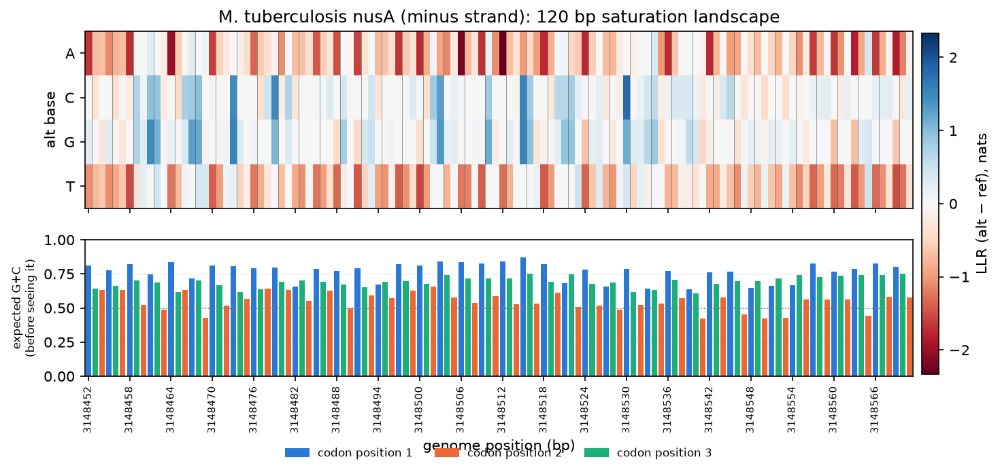
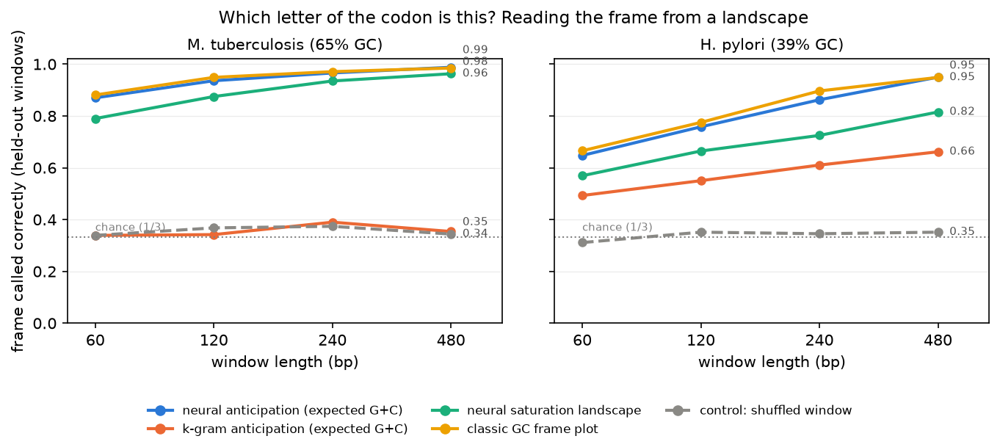

# Saturation Landscapes

*Part 11 of a series on teaching an AI to read DNA. Back in Part 3 I built a heatmap of every possible single-letter mutation across a stretch of DNA. It looked like static. Last post ended with a bet: point that heatmap at a real gene, and you'd see a stripe every three letters, drawn by a model nobody ever told about genes. This post settles the bet, measures it, and finds the one place the model sees stripes that aren't there.*

---

Part 3 introduced the **saturation landscape**. Take a window of DNA, try every possible letter at every position, and ask the model how surprised it is by each one. Stack the answers into a grid: four rows (the alternative letters A, C, G, T) and one column per position. Red means the model finds that change surprising; blue means it doesn't mind. Back then I pointed it at synthetic DNA and got what synthetic DNA deserves, which was confetti.

Ten posts later the model has read 18 real bacterial genomes, and Part 10 found something odd about what it learned. It had worked out, on its own, that genes are read three letters at a time, and it knew each genome's "handwriting" at each of the three codon positions. If that's true, a landscape drawn over a real gene shouldn't look like confetti. It should have a **rhythm**.

## Looking first

Here are 120 bases from the middle of *nusA*, a gene in *M. tuberculosis*. The model never trained on this genome. The top panel is the Part 3 landscape. Thin vertical lines mark where the annotation says each codon starts (the model never sees them).

You don't need to squint. The landscape pulses with the codons. The A and T rows light up red on a beat, because turning a G or C into an A or T is exactly the "wrong handwriting" Part 10 caught the model objecting to, and the beat lines up with the codon grid.

The bottom panel is the part I find genuinely surprising. For each position, it shows the probability that the next letter is G or C, which I'll call the model's **expected G+C**. The model computes this **before it sees that letter**, using only the DNA to its left. So it isn't a reaction to the letter. It's a *prediction*. And the prediction pulses too: high at some codon positions, down near 50% at codon position 2, every three letters, all the way across.

That's the model saying, in effect: *"I think the next letter is the second letter of a codon, so I don't expect much G or C."* It is placing itself inside the reading frame from context alone.

Averaged over hundreds of held-out genes, the prediction isn't just rhythmic, it's **calibrated**. In *M. tuberculosis*, genes are 68%, 50%, and 80% G+C at codon positions 1, 2, and 3. The model's *expected* G+C at those positions is 66%, 50%, and 80% on genes on the forward strand, and 67%, 49%, and 79% on genes on the reverse strand. That's within two percentage points of reality, predicted one letter ahead.

(I nearly fooled myself here. In the *nusA* window above, the model expects more G+C at position 1 than at position 3, which is the opposite of the genome-wide pattern. For a minute I suspected a strand bug. Checking the actual letters showed this stretch really is unusual: 74% vs 77%, nearly tied. The model was right about the local text, and I was projecting the average onto it. Check the letters before you trust the story.)

## Measuring it: can the landscape tell you which letter is which?

A picture is an anecdote. To turn "I can see stripes" into a number, I needed a question with a right answer, and gene annotations provide one. **Given a window of a gene, which of its letters is the first letter of a codon?** There are three possibilities (the reading frame), so random guessing is right one time in three.

The test:

1. Cut a window out of a held-out gene at a **random offset**, so its first letter could sit at codon position 1, 2, or 3.
2. Take any per-position signal over that window and average it by phase. That gives three numbers: the average over positions 1, 4, 7…; over 2, 5, 8…; and over 3, 6, 9….
3. Match those three numbers against a **template** learned from *other* genes in the same genome, trying all three rotations, and call the frame from the best match. The template is learned on half the genes and tested on the other half, so the frame caller never sees its own test genes.
4. Check against the annotation.

The important design choice is that **every signal gets exactly the same caller.** Any difference in accuracy then comes from the signal, not the method. I compared four:

- **Neural anticipation**: the model's expected G+C, computed before it sees each letter.
- **The neural landscape**: the Part 3 heatmap, averaged down each column.
- **k-gram anticipation**: the same "expected G+C" from the order-5 letter-counter that the neural net has had to beat since Part 2.
- **The classic GC frame plot**: no model at all, just "is this letter G or C?". This is a genuine old-school gene-finding trick, and unlike the anticipation signals it gets to look at the actual letters.

And one control: the same windows, **shuffled** (same letters, order destroyed, as in Part 9). With no genes left in them, every signal should fall back to one in three.

## The result

Over 1,000 held-out gene windows per genome:

| from 480 bp of gene | *M. tuberculosis* | *H. pylori* |
|---|---|---|
| **neural anticipation** (never sees the letter) | **0.99** | **0.95** |
| classic GC frame plot (reads the letters) | 0.98 | 0.95 |
| neural saturation landscape | 0.96 | 0.82 |
| k-gram anticipation | 0.35 | 0.66 |
| shuffled control | 0.34 | 0.35 |

And from a short 60-bp window (just 20 codons): 0.87 and 0.65 for neural anticipation, against 0.88 and 0.67 for the GC frame plot.

Three readings of that table, from most to least exciting:

**1. The model reads the frame as well as a tool that cheats.** The GC frame plot looks directly at every letter. The model's anticipation never looks at the letter it's predicting, and it still matches the frame plot at every window length in both genomes. It doesn't *beat* it: the two lines lie on top of each other, and the classic tool is a hair better on short windows. I'm reporting a tie, because that's what it is. But a tie reached by *prediction* means the model has an internal sense of "where am I in the codon?" that's as good as reading the answer off the page.

**2. The letter-counter can't do it.** The order-5 k-gram sees the same five letters of context the model starts from, and in *M. tuberculosis* its anticipation is pure chance: 0.35 from 480 bp. Five letters apparently isn't enough to tell where you are in a repeating three-letter cycle when the whole cycle is written in G's and C's. My best guess is that the neural model wins with its longer context, counting back along the rhythm over dozens of letters, but that's a guess I haven't tested. In *H. pylori* the k-gram does better (0.66), though still far behind the neural model.

**3. The landscape itself is a decent frame detector.** The humble Part 3 heatmap, averaged down its columns, calls the frame 96% of the time in *M. tuberculosis*. It's weaker in *H. pylori* (0.82), whose codon positions differ less from each other. When I first built it, the landscape looked like static. It turns out the static was mostly codons.

## The catch: it sees genes that aren't there

Accuracy on shuffled windows drops to chance, exactly as it should. But I also measured the *strength* of the rhythm (spectral power at period 3 compared with every other period; about 1 means no rhythm), and that showed something I didn't expect.

| period-3 rhythm strength | real genes | shuffled windows |
|---|---|---|
| observed letters (GC frame plot), *M. tb* | 21 | **0.7** |
| neural anticipation, *M. tb* | 649 | **33** |
| neural anticipation, *H. pylori* | 113 | **20** |

The shuffled *letters* have no rhythm at all (0.7), as expected, because shuffling destroys it. But the model's *predictions* on shuffled DNA still pulse at period 3, twenty to thirty times above the no-rhythm baseline. The phase is random, which is why frame-calling accuracy is at chance. But the rhythm is there.

So the model doesn't just *detect* codons. It **expects** them. Give it featureless GC-rich DNA and its internal clock starts ticking anyway, locking onto some arbitrary phase and predicting codon-style G+C on that beat. It's pareidolia, the way people see faces in clouds: a mind trained on a world full of genes sees genes in noise.

For the tools, that's not a curiosity, it's a rule. **"The model's predictions have a strong 3-base rhythm" is not evidence that a sequence codes for protein.** Any future "is this a gene?" tool must compare against the sequence's own shuffle, the same Part 9 move (let the model judge its own control), before it says a word.

## What I built

- **`site_profile`**: what the model expected at every position before seeing it (expected G+C, uncertainty), next to the landscape's column averages. It shares one pass through the model with the Part 3 scan, which I refactored so the two can never disagree (a test checks that they don't).
- **`frames.py`**: the frame test as plain numpy. Phase averages, templates learned on half the genes and tested on the other half, the frame caller, and the period-3 rhythm measure. It's tested on synthetic signals where the right answer is known exactly.
- **`landscape.py`**, grown up: a gene view that draws the landscape against the annotated codon grid, `--frame_test`, and `--compare` for the figure above.

There's no new bridge tool this time, deliberately. The obvious one ("which frame is this gene in?") needs a template learned from *some* genome's genes, and the pareidolia result says it would also need a shuffle null. I'd rather build that properly next to the old-school tools it has to compete with than ship it half-honest.

## Where this goes next

The most humbling line in that table is the classic GC frame plot: a one-line "is this letter G or C?" loop that ties a trained neural network at the network's own best trick. That's a signal. Before the model gets more credit for rediscovering biology, it should have to sit next to the tools biologists already use. Post 12, **Old-School Biology Tools**, builds them: an ORF finder, GC scans, restriction sites. They go behind the same tool schema, so the frontier model can call the dumb, deterministic answer and the neural one side by side, and I can find out where each one wins.
