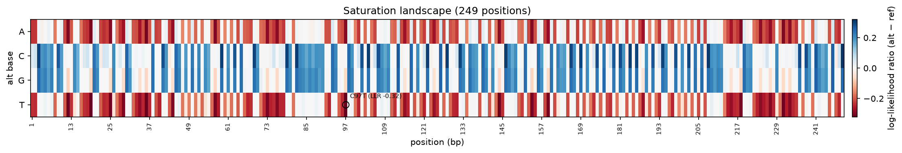

# Which Letters Actually Matter

*Part 3 of a series on teaching an AI to read DNA. Part 2 ended with a question. This is me trying to get the model to answer it, and being careful about what the answer actually means.*

---

I ended the last post with a promise that felt, honestly, like the whole reason I started this project. Now that I could measure the model honestly, I wanted to point it at something a curious person can actually *look at*: take a stretch of DNA and ask, letter by letter, **which of these actually matter?** Which single changes would break it, and which does the model just shrug at?

Way back in Part 1, the thing that grabbed me was exactly this. Sometimes one letter in your DNA flips — a `C` where there should be a `T` — and it means nothing. And sometimes that one flip means a disease. Modern medicine is, at its core, drowning in that one question: *which changes matter, and which don't?*

So this post is me building the smallest honest version of that question I could. And it turned into a really good lesson about not overclaiming.

## The idea: change everything, one letter at a time

Biologists have a name for the wet-lab version of this. It's called **saturation mutagenesis**, which sounds intimidating and just means: take a piece of DNA and systematically make *every possible single-letter change*, then see what each one does.

Think about what that involves in real life. You've got a stretch of, say, 250 letters. At each position there are three other letters it could have been (if it's an `A`, it could've been `C`, `G`, or `T`). So that's 250 × 3 = 750 different mutant versions, each one built and tested in a lab. It's heroic, expensive, slow work. People build careers on it.

Here's the thing that made me sit up. My model already does the one thing this needs: it can look at DNA and tell you *how surprised it is* by each letter. That was the whole point of Part 2 — bits of surprise, the scoreboard where 2.0 means "total coin-flip, learned nothing" and lower means "I see a pattern here."

So I don't have to build 750 mutants in a dish. I can just *ask* the model: "at this spot you saw a `C`. How surprised would you have been to see a `T` instead? A `G`? An `A`?" Do that at every position, for every alternative letter, and you get a complete map of the model's opinion about which letters belong where.

The best part: my model reads a whole sequence in one pass. So the entire map — every position, every alternative — falls out of a **single read-through**. What takes a lab months takes my laptop a fraction of a second. (With the enormous asterisk that a lab result is real biology and mine is one small model's opinion. Hold that thought. It's the whole back half of this post.)

## Turning "surprise" into a picture

Numbers in a table are useless to a curious kid, and I'm building this for curious kids (myself included). So I turned the map into a heatmap.

Read it like this. Left to right is position along the DNA — letter 1, letter 2, and so on. Top to bottom are the four letters you could swap *in*: A, C, G, T. Each little colored cell answers one question: *"if I forced this letter in at this spot, how would the model react?"*

- **Red = the model didn't like it.** Swapping in this letter here makes the sequence look *less* natural to the model. In the language of the last post, it raises the surprise. These are the "this letter seems to matter" cells.
- **Blue = the model shrugged, or even preferred it.** Putting this letter here is fine, or better than what was already there.
- **White = no change.** There's always one white cell per column: the letter that's *actually there*. Swapping a letter for itself does nothing, by definition. (That "it's exactly zero when you change nothing" is one of the sanity checks I wrote a test for — if that ever came out non-zero, the whole map would be lying, and I wouldn't know.)

The single most-disruptive change in the window gets circled and labeled. On this run it was a `C` that the model *really* wanted to keep — turning it into a `T` was the change it found least natural of all 750.

That's the dream from Part 1, made literal. A wall of DNA, lit up by where the letters matter.

## Now the part where I try not to fool myself

If I stopped here it would make a great screenshot and be quietly dishonest. So, two confessions.

**Confession one: "surprising" is not the same as "would break the gene." These are different questions, and pretending they're the same is exactly the trap.**

What my fast map actually measures is: *given all the letters that came before it, how surprising is this letter right here?* It's a pure, local, single-spot surprise. It reads left-to-right and judges each letter by its run-up.

But that is **not** the same as "how much damage does this mutation do." A real mutation can ripple. Changing one letter can throw off how the model reads *everything that comes after it* — like a typo early in a sentence that makes the rest parse wrong. My fast map is blind to that ripple. It scores the letter in isolation, using only what came before, and never asks "okay, but how does this swap mess up the downstream reading?"

So a letter can look shocking on the map and be basically harmless. And a letter can look calm and actually be load-bearing. Conflating "the model was surprised by this letter" with "this mutation is dangerous" would be precisely the kind of overclaim this whole series is supposed to avoid.

Here's how I handled it instead of hand-waving. I built **two** tools, on purpose:

- The **fast one** (the map above) — one read-through, whole window, great for an overview. "Where should I even look?"
- A **slower, more careful one** — for any single spot you care about, it re-reads the whole neighborhood around the mutation, both directions, and accounts for the downstream ripple. It costs a lot more, so you'd never run it on all 750, but it's the right call for the handful the map flagged.

The workflow is: **fast map to find the suspects, careful tool to interrogate them.** The map is a metal detector, not a verdict. I wrote that distinction into the code's documentation and the tool descriptions themselves, so future-me (and the bigger AI that eventually calls these tools) can't quietly forget it.

**Confession two: look again at that heatmap. It's kind of... washed out.**

The reds and blues are faint. There's no dramatic bright-red stripe screaming "THIS LETTER IS SACRED." And that's not a bug — it's the honest consequence of something from Part 2.

That map was made on my **synthetic toy data** — genomes I generated on purpose to share no real grammar. On that data, nothing beats random, because there's genuinely nothing to learn. A model that's near-random *should* produce a near-flat landscape, with every possible swap looking about equally meh. Which is exactly what it did.

If I'd trained on real bacteria and shown you a gorgeous, high-contrast landscape, I'd be claiming I cracked biology. I haven't. What I've actually built and verified is the **machinery**: the thing that will draw a sharp, meaningful landscape *the moment there's real signal to draw*. The pipeline is real. The biology is still ahead. Same lesson as last time — I've earned the right to measure, not the right to brag.

## What I actually shipped

Stripped of the storytelling, this increment added:

- A way to score **every single-letter change** across a DNA window in one read-through, returning a ranked list of "most surprising swaps."
- A **heatmap** so a person can see the whole landscape at a glance.
- A **command** so making one of these figures is a single line in the terminal.
- The careful distinction — fast single-spot surprise vs. slow whole-neighborhood damage — baked into two separate tools instead of blurred into one misleading number.
- Tests that pin down the parts that would silently corrupt the map if they broke (the "change-nothing-is-exactly-zero" check, the ordering of the ranked list, the fact that it gives the same answer every time).

And it's wired up so the bigger frontier model can call it as a tool — hand it a sequence, get back the ranked suspects, without the big model ever having to squint at raw `ACGT` itself. That bridge is a whole arc I'll get to later.

## Where this leaves me

Part 1 asked *why*. Part 2 built the honest ruler. Part 3 is the first time the model *pointed at something* and told me where it thinks the letters matter — while I bent over backwards not to oversell what "matters" means.

The map is faint today because the data is a toy. But the machine that draws it is real, tested, and waiting for real genomes. When I finally feed it bacteria that actually share the grammar of life, this same picture should light up with genuine structure — and *that* will be a post I'm excited to write.

Next, though, I want to flip the whole thing around. So far the model has only ever been a *reader* — it judges DNA that already exists. What happens if I let it *write*? Hand it a few starting letters and let it dream up the rest, one base at a time, the way ChatGPT continues a sentence. Does it produce something that looks like real DNA, or beautiful nonsense? And — the honest question — how would I even tell the difference?

That's Part 4. The model stops grading and starts dreaming.
