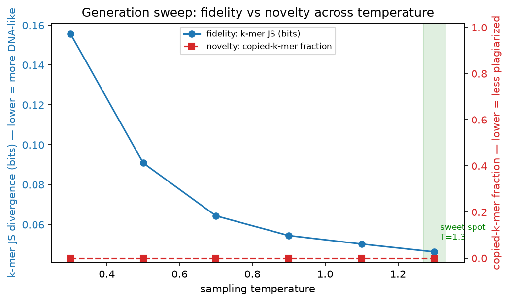

# The Model Dreams

*Part 4 of a series on teaching an AI to read DNA. So far the model has only ever been a critic. This is the post where I let it pick up a pen — and then had to figure out whether anything it wrote was real.*

---

Every post so far, my little model has been a *reader*. It takes DNA that already exists and judges it: how natural does this look, which letters matter, how surprised am I by this stretch. A critic. A very opinionated critic with six letters in its vocabulary.

But language models don't just grade sentences. The whole reason ChatGPT feels like magic is that it *writes* — you give it a few words and it keeps going. Mine is the same kind of machine, just pointed at DNA. So the obvious, irresistible next question: what happens if I stop asking my model to grade DNA and start asking it to *make some*?

Give it a starting letter and let it dream.

## The dream looks unnervingly real

Here's a real stretch of DNA from a genome my model had never trained on, next to a stretch my model made up from scratch. One of these is billions of years of evolution. The other is a 12-million-knob baby guessing one letter at a time. Can you tell which is which?

```
TCACCTAGGGAGCCTGTCCAGTACGCCGATGCATCTATACCTACACAGCTGTCTGAAAGA
AGAAGATTCTCCGGCATCGCCGGTGAAACAGGCCTTCCGGGACCAGCGCTATGGTCGACG
```

The first one is real. The second is the dream. And honestly? At a glance, they're indistinguishable. Both are just `A`, `C`, `G`, `T` in a plausible-looking jumble. No obvious repeats, no giveaway weirdness. If I showed you the dream and told you it came out of a bacterium, you'd have no reason to doubt me.

Which is *exactly* the problem.

## "Looks like DNA" is not a measurement

This is the trap I've now walked into three times in this series, and I'm finally starting to recognize its face. Something *feels* right, so I want to declare victory. And feelings, as Part 2 beat into me, lie.

"It looks like DNA" is a vibe, not a number. To actually judge a dream I need to compare it to real DNA on something measurable. So I reached for the same idea I've leaned on the whole way: **statistics of little chunks.**

If you slide a window across real DNA and tally up how often each short combination of letters shows up — every `ACGT`, every `GGCA`, and so on — you get a kind of fingerprint. Real genomes have a characteristic fingerprint: some combos are common, some are rare, and the pattern is not random. A good dream should have a *similar* fingerprint. A bad one won't.

So I measure the distance between the dream's fingerprint and real DNA's fingerprint. Zero means identical. The bigger the number, the more the dream's statistics drift from real biology. I call this the **fidelity** score — how faithfully the dream mimics the real thing. (I also switched to a version of this distance that's mathematically bounded between 0 and 1, instead of the open-ended one I'd been using, because a score that can run off to infinity is a score I'll eventually misread.)

Now I had a real ruler for dreams. And immediately, the ruler tried to trick me.

## The catch: a perfect score by cheating

Here's the thing that stopped me cold, and it's the same lesson as the memorizing-counter from Part 2, wearing yet another disguise.

There's a way to score *perfectly* on fidelity that involves learning nothing about generation at all: **copy.**

If my model just spits back a chunk of DNA it saw during training, verbatim, then of course its fingerprint matches real DNA perfectly — it *is* real DNA. It plagiarized. It gets a flawless fidelity score and has demonstrated exactly zero ability to generate anything new. It's the kid who "wrote a brilliant essay" by copying Wikipedia.

Fidelity alone can't catch this. A perfect copy and a brilliant original both score perfectly. So a single number — no matter how sophisticated — is not enough. I need to measure a *second*, completely different thing at the same time:

**Novelty.** Is the model actually *producing* sequence, or just *regurgitating* it? I check this bluntly, like a plagiarism detector: take long chunks of the dream and see how many of them appear word-for-word in the real reference. If lots of the dream is copied verbatim, that's cheating, no matter how good the fidelity looks. I also track the single longest stretch it copied exactly — one really long copied run is a red flag all by itself.

So now a dream has to pass **two** tests at once. It has to *look* like DNA (good fidelity) **and** be something the model actually *made up* (good novelty). "It looks like DNA" and "it made up DNA" are different claims, and you need both to be true before you're allowed to feel good.

## Temperature is the dial that trades them off

Here's where it gets fun, because these two goals fight each other, and there's a single knob that controls the fight.

When the model generates, there's a setting called **temperature** that controls how bold it is. Turn it *down*, and the model plays it safe, always reaching for the most obvious next letter. Turn it *up*, and it takes more risks, picks less likely letters, gets weird.

And those two extremes fail in opposite ways:

- **Too cold**, and the model gets repetitive and timid. It falls into loops and, worse, tends to parrot back the safe, common patterns it saw in training — which pushes it toward *copying*. Great fidelity, terrible novelty.
- **Too hot**, and it goes off the rails into random noise that stops looking like DNA at all. Great novelty (it's certainly not copying), terrible fidelity.

The good stuff — if there is any — lives in the middle. So instead of picking one temperature and hoping, I sweep across a whole range and plot both scores together. This is the picture the whole post was building toward:



Blue is fidelity (lower = more DNA-like). Red is copying (lower = more original). You want to find the temperature where blue is low *and* red is low at the same time — the sweet spot where the model is writing convincing DNA that it actually invented.

## The honest part (there's always an honest part)

Look closely at that red line, though. It's flat on the floor. My model isn't copying at *any* temperature.

That sounds like a triumph. It isn't — and understanding why is the whole point of building the honest version.

That sweep is on my **synthetic toy data** again: genomes I generated to have no real, deep structure. There's nothing meaningful to memorize, so of course the model doesn't plagiarize — there's no rich pattern there to copy in the first place. And the fidelity line improving as things heat up mostly reflects the model escaping cold, timid loops, not some deep grasp of biology.

So what I've actually built here is, once again, the **referee, not the champion**. I have a fair, two-sided way to judge generated DNA — one that measures faithfulness *and* originality, and won't let a copycat model fool me by acing one while flunking the other. The machinery is real and tested. What I *haven't* shown is a model that dreams up beautiful, novel, biologically-real bacterial DNA. That test requires real bacteria, and it's coming.

I keep landing in the same place at the end of these posts, and I've decided that's the most important pattern in the whole project: the hard part was never getting a good-looking result. Good-looking results are cheap. The hard part is building the thing that tells you whether the good-looking result is actually good — or just flattering you.

## Where this goes next

I've now spent four posts almost entirely on toy data, sharpening rulers: bits-per-base, the Markov opponent, the mutation landscape, and now the fidelity-vs-novelty sweep. That was on purpose. I wanted every measuring stick built and stress-tested *before* I pointed them at something real, so that when I finally do, I can trust what they tell me.

That's Part 5. I'm done with toys. Next post I feed the whole apparatus real bacterial genomes — organisms that genuinely share the grammar of life, patterns a dumb counter can't fully capture but a neural net just might. It's the first time the model gets a fair shot at showing it learned something a lookup table can't.

That's the moment this whole series has been quietly building toward: real DNA, honest rulers, and finally finding out whether the baby can actually read.
