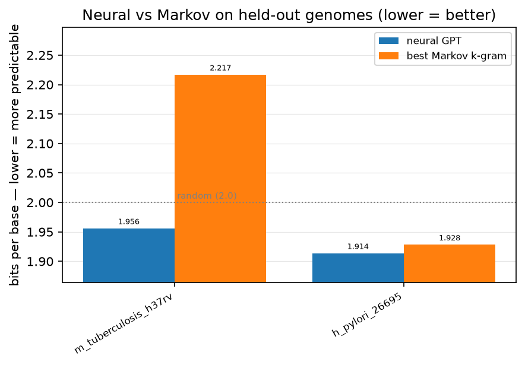

# Real Bacteria, Real Grammar

*Part 5 of a series on teaching an AI to read DNA. For four posts I built rulers on toy data so I couldn't fool myself. This is the post where I finally point them at real life.*

---

I have been stalling, and I want to be honest about it.

For four posts, everything ran on **synthetic** DNA — genomes I generated myself, on purpose, so I could test my measuring tools without the universe getting a vote. That wasn't procrastination. It was the whole strategy: build the ruler, stress-test the ruler, make sure the ruler doesn't lie, all *before* measuring anything that matters. Because a measurement you can't trust is worse than no measurement — it's a confident wrong answer.

But there's only so long you can practice. At some point you have to take the real test. This post is the real test: I downloaded actual bacterial genomes — organisms that have been evolving for billions of years — and asked the question the entire series has been building toward.

**Does my little neural net actually understand DNA better than a dumb letter-counter?**

## Remembering the opponent

Quick refresher, because the opponent is the point. Back in Part 2 I built a rival on purpose to keep myself honest: a **Markov model**, which is a fancy name for *counting*. It goes through the training DNA and tallies "after these few letters, what usually comes next?" No neural network, no learning in the fancy sense. Just a lookup table a motivated person could build in an afternoon.

That counter is the bar my whole project has to clear. If a neural network with millions of tunable knobs can't out-predict a lookup table, it has justified nothing. And on synthetic data — which I deliberately built to have no deep structure — *nothing* beats the counter, which was exactly the point: it proved my ruler wasn't inventing signal that wasn't there.

Real bacteria are different. Real genomes have deep, long-range grammar — patterns that go beyond "what letter usually follows these three." A counter, by its nature, can only see a few letters back. The bet of this entire project is that a neural net can see *further* and *deeper*, and that on real DNA that extra vision finally shows up as a win.

Time to find out.

## The trap I almost walked into

Before the result, I have to tell you about a subtle mistake I nearly shipped — because catching it is more important than any number.

To test "does the model generalize to DNA it's never seen," you hold some genomes *out* of training and test on those. Simple. But *how* you hold them out matters enormously, and my old code did it lazily: it just chopped off the last 10% of the combined data file as the test set.

Here's why that's quietly broken on real data. When you glue 20 genomes into one file and slice off the tail, your "held-out test" is just *whichever organism happened to be last in the file* — maybe a random chunk of one genome. Your grand claim about "generalizing across bacteria" secretly rests on "predicting the back half of the one genome that sorted last." That's not a fair test. That's an accident wearing a lab coat.

So I fixed it. Now I hold out **entire, deliberately chosen genomes**. When I test on *Mycobacterium tuberculosis*, the model has never seen a single letter of *M. tuberculosis* — not the front, not the back, none of it. That is the honest version of "can you read an organism you've never met."

This is the Part 2 lesson resurfacing, and it keeps resurfacing because it's *the* lesson: the model with a million knobs will happily tell you what you want to hear. The only defense is a test it cannot game. Whole-genome holdout is that test.

I made the held-out organisms deliberately *unlike* the training set, too. My training bacteria are mostly low-GC (heavy on A and T). I held out *M. tuberculosis*, which is famously **65% G and C** — a genome that, letter-frequency-wise, looks like a different dialect. If the model only learned "this training set likes As and Ts," it'll fall flat here. Good. I want the hard version.

## The result

It won. On both held-out genomes, the neural net was less surprised by DNA it had never seen than the best counter was — and on the hard one, it wasn't close.

Here are the numbers, in bits per base (lower = better; 2.0 = random guessing, the "learned nothing" line):

| Held-out genome | Neural net | Best counter | Winner |
|---|---|---|---|
| *H. pylori* (39% GC) | **1.914** | 1.928 | neural, by a hair |
| *M. tuberculosis* (65% GC) | **1.956** | 2.217 | **neural, by a mile** |

Look at that second row, because it's the whole story of this project in one line.

## Reading it like an adult

On *M. tuberculosis*, the counter didn't just lose — it scored **2.217 bits, which is worse than random guessing.** Sit with that. A model built entirely from counting patterns in my (mostly low-GC) training bacteria was *actively misled* by them when handed a high-GC organism. It had confidently learned "DNA looks like A's and T's," and *M. tuberculosis*, at 65% G and C, punished that assumption harder than knowing nothing at all. It's the exact memorization failure from Part 2 — the counter that aces the training distribution and faceplants the moment the distribution shifts.

The neural net, on the same never-before-seen genome, stayed at **1.956** — comfortably below random, comfortably ahead of the counter. It didn't just memorize "this dataset likes A and T." It picked up something more portable about how bacterial DNA is structured, something that survived the jump to an organism with a completely different letter balance. That is the difference between *reading* and *reciting*, and it's the first time in five posts I've watched my model actually do the reading on real life.

On *H. pylori* the win is real but tiny (1.914 vs 1.928) — that genome's composition is closer to the training set, so the counter isn't blindsided, and the neural net's edge shrinks to a sliver. That's honest too: the model's advantage is biggest exactly where generalization is hardest, and smallest where counting was already doing fine. That's the *shape* I'd hope for if the win is real rather than a fluke.

The rule I set for myself back in Part 2 still holds, and I refuse to move the goalposts now: a **win** means the neural net beats the *best* counter — not a strawman k=2 counter, the best one at any order. A tie is a tie. And a *loss* on some organism is not a failure to hide; it's data, and it tells me something real about where the model's vision runs out.

I also report each held-out genome **separately**, on purpose. If I only showed you one averaged number, a single organism the model happens to nail could paper over another it flubs. Per-genome, there's nowhere to hide — you see exactly which bacteria the model reads well and which leave it as clueless as the counter.

## The honest state of things

One thing I want to be scrupulous about: this is a *small* model trained on a *laptop* for a *short* time, on a handful of genomes. It is not a triumph of scale. Whatever the number above says, it is the honest output of a fair test at a tiny budget — not a claim that I've built something that competes with real genomics tools. The value here isn't the magnitude of the win or loss; it's that the **measurement is trustworthy**, because the test can't be gamed and the opponent is real.

That's the through-line of the whole series. I've spent five posts caring less about impressive results and more about *not fooling myself*, because a bedroom project with millions of parameters is a machine for self-deception unless you build the guardrails first. Now the guardrails are up, the opponent is real, and the test is fair.

## Where this goes next

Whatever this first real result is, it raises the obvious next question — and it's a question I can now ask *honestly*, because I finally have a trustworthy number to watch: **if I make the model bigger, does that number get better?**

That's Part 6. I take this same fair test, this same held-out set, and I grow the baby — more layers, more knobs — and watch whether the honest number actually moves, or whether it plateaus and the model just starts memorizing. Because "bigger is better" is another comfortable story, and comfortable stories are exactly the ones this series exists to check.
