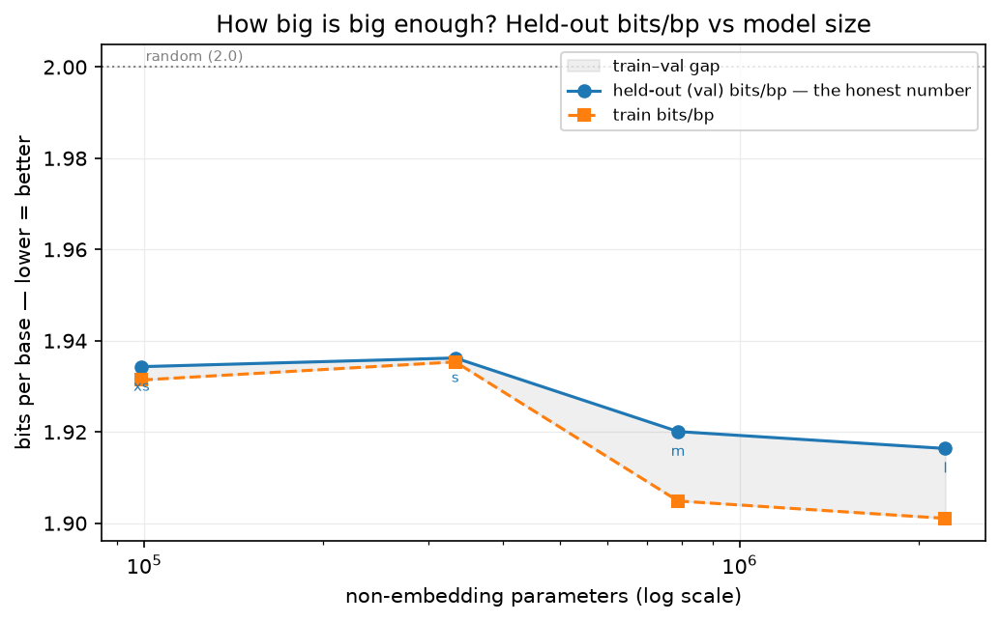

# How Big Is Big Enough?

*Part 6 of a series on teaching an AI to read DNA. Last post, the little model finally beat the letter-counter on real bacteria. The obvious next thought — "so make it bigger" — turns out to hide a trap.*

---

Last post ended on a genuine high. For the first time in the whole project, my small neural net beat the dumb letter-counter on *real* bacterial DNA it had never seen — and on one hard genome, it beat it badly. After five posts of building rulers and refusing to celebrate, I finally had something real to celebrate.

So of course my very next thought was the thought everybody has: **make it bigger.**

That's the entire story of modern AI, right? The models that write essays and code got good by getting *enormous* — more layers, more knobs, billions of parameters. My baby has a few hundred thousand. Surely if I just grow it, the honest number gets better and better.

Maybe. But "make it bigger" is a comfortable story, and this series exists to check comfortable stories before believing them. So instead of just scaling up and hoping, I ran an actual experiment — and it taught me where "bigger" quietly stops meaning "better."

## How to grow a model without lying to yourself

Here's the subtle part, and it's the whole reason the experiment is worth anything.

If I want to know whether *size* makes the model better, I have to change *only* size. Nothing else. If I grow the model **and** feed it more data **and** train it longer, and the number improves — which change gets the credit? I'd have no idea. I'd just have a better number and a story I made up about why.

So I froze everything except capacity:

- **Same data.** The exact same real bacterial genomes as Part 5.
- **Same test.** The exact same held-out genomes — *M. tuberculosis* and *H. pylori*, still never seen during training.
- **Same budget.** Every model, big or small, gets to look at the *same total amount of DNA* during training. Not the same number of steps — the same number of *letters seen*. A bigger model doesn't get to also study longer; that would be two changes at once.

With all of that nailed down, the only thing that differs between my models is how many knobs they have. Then I grew the model in steps — I call them rungs on a ladder, from "xs" up to "l" — and watched the one number I trust: bits per base on the held-out genomes. Lower is better; 2.0 is the "learned nothing" line.

## The curve

Here's what four rungs of the ladder gave me, on the held-out genomes, in bits per base (lower = better):

| Model | Parameters | Held-out (val) | Diminishing? |
|---|---|---|---|
| xs | 99k | 1.934 | — |
| s | 333k | 1.936 | basically flat |
| m | 788k | 1.920 | a real step down |
| l | 2.2M | 1.916 | **almost nothing** |

Two things jump out. First, bigger *did* help — the honest number dropped from 1.934 to 1.916 as the model grew. Real, if modest. But second, look at that last rung: I nearly **tripled** the model from m to l (788k → 2.2M parameters) and the held-out number barely twitched, from 1.920 to 1.916. The curve is flattening out. I'm paying exponentially more parameters for pennies of improvement.

That's *diminishing returns*, live. But the more interesting story is the second line.

## The catch nobody puts on the poster

There are **two** lines on that chart, and the second one is the real lesson.

The blue line is the honest number: how well the model reads DNA it has *never seen*. The orange line is how well it reads the DNA it *trained on*. And the gray gap between them is the whole ballgame.

When a model is genuinely learning the *grammar* of DNA — patterns that generalize — both lines drop together, and the gap stays small. The model isn't memorizing its textbook; it's learning to read, so it does about as well on the exam as on the homework.

But watch what happens as the model gets bigger on a *fixed, smallish* pile of data. At the two small rungs, the gap is basically nothing — about **0.003 bits**, the lines sit right on top of each other. By the largest rung the gap has widened five-fold to **0.015 bits**: the training line keeps dropping (the model's getting better at reciting the homework it's seen), while the held-out line has flattened out (it's no better at the actual exam). At some point the model has more capacity than the data has lessons, so it spends those extra knobs **memorizing the training DNA** instead of learning transferable grammar. The gap fans open.

It hasn't gone *catastrophic* here — my held-out number is still slowly improving, not crashing. But the trend is unmistakable and it's pointing the wrong way: I'm buying a widening memorization gap and a flattening exam score. Push this a few rungs further on the same tiny dataset and I know exactly what I'd see, because I already saw it in Part 2.

That fanning-open gap is the exact same ghost from Part 2 — the counter that aced its training data and face-planted on anything new — except now it's *my* neural net doing it, just more subtly, and only once I made it too big for its diet. It's memorization, caught in the act, at the scale of the whole model instead of a single lookup table.

## "Big enough" is really a question about data

Here's the reframe that this experiment burned into me, and it's genuinely one of the most useful things the whole project has taught me.

I kept asking "how big should the model be?" — but that's the wrong question, or at least an incomplete one. Past a certain point, my model wasn't *capacity*-limited at all. It was **data**-limited. The extra parameters had nothing new to learn from my handful of genomes, so they did the only other thing parameters can do: memorize noise.

You can't out-*model* a data shortage. A bigger brain with the same tiny library just memorizes the library. If I want the honest number to keep dropping past the plateau, the answer isn't "more layers" — it's "more genomes."

Which is a much more useful — and much more honest — conclusion than "bigger is better." It tells me *exactly* what to spend my next effort on, and it's not architecture.

## The honest footnotes

I want to be scrupulous, as always. This is a ladder of *tiny* models trained on a *laptop* for a *short* time on a *handful* of genomes. The exact place the curve bends would move with a bigger data budget, a real GPU, longer training. I am absolutely not claiming to have measured some universal law of DNA models. What I built is the *apparatus* for asking the scaling question fairly — freeze everything but size, watch two lines, respect the gap — and a first, small, honest reading from it.

And notice the pattern, five posts running now: the exciting part was never the result. It was the *guardrail*. Bits-per-base, the Markov opponent, whole-genome holdout, the fidelity-vs-novelty split, and now the train–val gap on a scaling curve. Every one of them exists for the same reason — a project with a million knobs will happily tell you a flattering story, and the only defense is a measurement it can't wriggle out of.

## Where this goes next

This experiment handed me my own to-do list. It said, in effect: *stop fiddling with the model, and go get more and better DNA.* The plateau isn't an architecture problem; it's a data problem.

So that's Part 7. I stop growing the model and start taking the **data** seriously — where it comes from, how dirty it is, why duplicate and junk genomes quietly poison a reader, and what "more and better DNA" actually means in practice. Because the model, it turns out, is only ever as good as the library you raise it in.
