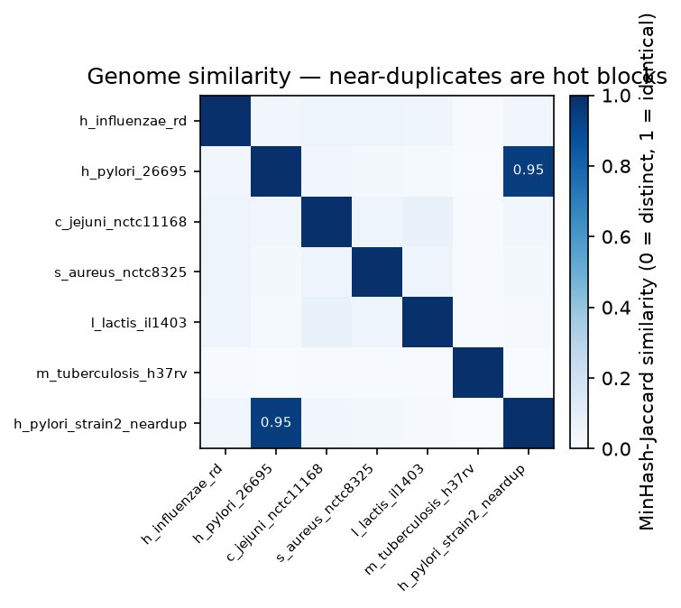

# The Data Is the Model

*Part 7 of a series on teaching an AI to read DNA. Last post, scaling the model up hit a wall and pointed at the real bottleneck: the data. So this post I stop touching the model and start taking the data seriously — and find a trap that could have quietly faked my best result.*

---

Part 6 ended with a finger pointing away from the model. I'd grown the network bigger and bigger and watched the payoff shrink to nothing — the honest number flattened while the model just started memorizing. The conclusion was uncomfortable and clear: **my problem isn't the model, it's the data.** A bigger brain with the same tiny, messy library just memorizes the library.

So this post I don't touch the model at all. I go look — really look — at what I've actually been feeding it. And it turns out "just download some genomes" hides two problems, one boring and one that genuinely rattled me, because it could have secretly faked the win from Part 5.

## Garbage in

The boring problem first, because it's real and quick.

Genome files off the internet are not clean strings of `A`, `C`, `G`, `T`. They're full of stuff:

- **Unknown bases.** Long runs of `N` — "the sequencer couldn't tell." And beyond `N`, a whole zoo of ambiguity codes (`R` means "A or G," `Y` means "C or T," and so on) for positions the sequencer was only *partly* sure about.
- **Low-complexity dust.** Stretches like `ATATATATAT…` or `AAAAAAAAA` — real, but repetitive junk that teaches the model almost nothing except "sometimes DNA stutters."
- **Tiny fragments.** Tucked-in contigs a few hundred bases long that are more noise than signal.

None of this is hard to clean — drop the too-short records, cap how much unknown junk a genome can contain, map the weird letters to a neutral "unknown," trim the ragged N-runs off the ends. I wrote a little cleaning pass that does exactly that and *reports* what it would throw away rather than silently mangling anything. Boring, necessary, done.

Then I hit the problem that actually matters.

## The subtle killer: genomes that are secretly the same

Here's the thing nobody warns you about when you cheerfully decide to "train on lots of bacteria."

Genome databases are full of **near-duplicates.** Not exact copies — those are easy to spot — but *strains*: the same organism, sequenced by a different lab, 99% identical with a scattering of differences. Search for *E. coli* and you don't get one genome; you get dozens of near-identical siblings.

This wrecks things in two ways, and the second one is the one that scared me.

**Way one — wasted effort.** Ten near-identical *E. coli* strains are not ten genomes of signal. They're basically one genome, ten times. And as Part 6 taught me the hard way, showing a model the same thing ten times isn't teaching — it's *inviting memorization*. My "big diverse corpus" might be far less diverse than the file count suggests.

**Way two — the leak.** This is the one. Remember the entire foundation of my Part 5 result? I held out whole genomes — *M. tuberculosis*, *H. pylori* — and showed the model could read organisms it had **never seen.** That was the win. That was the proof it learned real, transferable biology instead of memorizing.

Now imagine a near-identical strain of *H. pylori* was sitting in my *training* set. Then "the model generalizes to an organism it never saw" quietly becomes "the model already studied that organism's identical twin." My proudest result would be **partly memorization wearing a disguise** — and, exactly like every trap in this series, I'd have no way of knowing from the number itself. It's the Part 2 lesson — *train and test must not overlap* — resurfacing one level up: it's not enough that the *exact* held-out genome is absent from training. Nothing that's *nearly the same* as it may be in there either.

I needed a way to catch near-twins. Not "are these two files identical" — that's trivial — but "are these two genomes *suspiciously similar*."

## Fingerprinting a genome

The tool for this is genuinely clever, and it's the same idea real bioinformatics tools (like Mash) use. It's called **MinHash**, and the intuition is a fingerprint.

You can't cheaply compare two whole genomes letter by letter — they're millions of bases long and don't even line up. But you *can* do this: chop each genome into all its little overlapping chunks (I use 14-letter windows), and instead of keeping all of them, keep a small, fixed-size *sample* of them chosen in a consistent way. That sample is the genome's fingerprint — a few hundred numbers that stand in for the whole thing.

The magic is that two genomes' fingerprints overlap by roughly the same fraction that the genomes themselves do. Two unrelated bacteria share almost none of their fingerprint. Two strains of the same species share most of it. So I can estimate "how similar are these two genomes?" by comparing two little fingerprints instead of two enormous sequences — near-instantly. (One subtlety I had to get right: DNA is double-stranded, so I fingerprint each chunk and its mirror-image the same way, or a genome would look different from its own reverse strand. Same double-strand lesson from Part 2, showing up again.)

Draw every pairwise similarity as a grid, and near-duplicates jump out as hot squares:

The dark diagonal is just every genome being identical to itself. What you're hunting for is a dark square **off** the diagonal — and there it is. I deliberately slipped a near-duplicate *H. pylori* strain into this corpus (a copy with ~0.3% of its letters changed, to simulate a real second strain), and the fingerprints caught it instantly: **0.95 similarity**, lit up bright, impossible to miss. Everything else is near-white — genuinely different organisms.

## The guard

Catching duplicates is nice. But the thing I actually care about is protecting the honesty of my held-out test. So I wired the fingerprints into a hard rule in my data-prep step — a **leakage guard**:

> Before accepting a train/test split, check every held-out genome against every training genome. If any held-out genome has a near-twin in training, **refuse the split** and say exactly which two genomes are the problem.

It's not a warning you can scroll past. It's a stop sign. When I fed it the poisoned corpus and asked it to hold out *H. pylori* while its near-twin sat in training, it flat-out refused:

> *train/val leakage — held-out genome has a near-twin in train: h_pylori_26695 ~ h_pylori_strain2_neardup (Jaccard 0.95). Dedup the corpus, choose a different holdout, or pass --allow_leakage.*

That's the guardrail working exactly as intended: it made a silent, invisible way of fooling myself into a loud, blocking error. Turn on deduplication and the offending twin gets dropped automatically, the split goes through clean, and the honesty of the test is restored.

And the payoff I actually wanted: **I ran the guard on my real Part 5 corpus.** The most similar any held-out genome got to anything in training was a Jaccard of **0.035** — essentially unrelated. No leak. Which means the result I was proudest of, the one this whole series had been building toward, *survives the check.* The *M. tuberculosis* win was real reading, not a duplicate hiding in the training set. I didn't just hope that was true anymore — I checked, and now I can say it.

## Why this is the most important boring post

I'll be honest: "I cleaned my data" is the least glamorous sentence I've written in this series. There's no clever model, no surprising curve. But it might be the most *important* increment, and here's why.

Every trap in this project has had the same shape. The model — or the data — offers me a flattering story, and the only thing standing between me and believing it is a guardrail I had to build *on purpose*: bits-per-base, the Markov opponent, whole-genome holdout, the fidelity-vs-novelty split, the train–val gap, and now the leakage guard. The data-quality work isn't preprocessing I do *before* the real project. It **is** the project. "The data is the model" isn't a slogan — it's the literal finding of Part 6, now with tools behind it.

Cheap to say, easy to skip, and the exact thing that separates a result you can trust from a number that's quietly lying to you.

## Where this goes next

I now have the two things I was missing at the end of Part 6: a reason to want more data (the model is starving) and the tools to make sure more data is actually *more*, not the same genome wearing ten different filenames. "More and better DNA" finally means something concrete — deduplicated, cleaned, leak-checked.

So the next stretch of this project is exactly that: grow the corpus for real, run it through these quality gates, and go back to the scaling curve from Part 6 to see whether feeding the starving model a bigger, cleaner library finally makes the honest number move again. The model's been waiting on the data this whole time. Time to go get it the good stuff.
