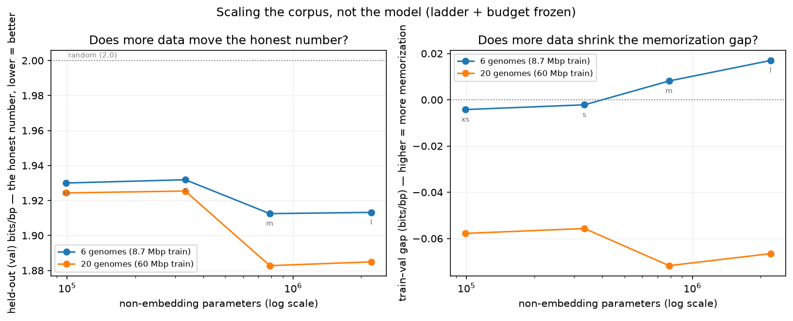

# Feeding the Starving Model

*Part 8 of a series on teaching an AI to read DNA — and the close of its first arc. For six posts I built a model and, more importantly, built the guardrails to keep it from fooling me. The last two posts pointed at the same fix: the model isn't too small, it's starving. This post finally feeds it — and looks honestly at whether that was the right diagnosis.*

---

Two posts in a row ended by pointing at the same thing.

Part 6 scaled the model up and watched the payoff die: past a point, a bigger network on my tiny pile of genomes just started **memorizing** instead of learning. The conclusion was "you can't out-model a data shortage — the answer isn't more layers, it's more genomes." Part 7 then built the tools to take that seriously — cleaning, deduplication, and a leakage guard — so that "more genomes" would mean *more*, not the same organism wearing ten filenames.

Which left one obvious, falsifiable promise hanging: **if the model is really starving, then feeding it should move the number.** Not the model — the number I actually trust, held-out bits per base on genomes it never trains on. This post is that experiment. And because it's the last post of Arc I, it's also where I get to look back and ask what a six-letter language actually taught me.

## The one-change rule, again

Part 6's whole credibility came from changing exactly one thing at a time. I grew the *model* and froze everything else — same data, same held-out test, same training budget — so that when the number moved I knew *why*. If I'd grown the model and the data and the training time all at once, a better number would've been a mystery with a nice story attached.

So this experiment obeys the same rule, just with the knob moved. I freeze the model ladder (the same four sizes, xs through l) and freeze the budget (every model still sees the exact same total amount of DNA). The **only** thing that changes is the training corpus:

- **Before:** 6 genomes. After holding two out for the test, **4 genomes / 8.7 million bases** to learn from.
- **After:** 20 genomes. Same two held out, now **18 genomes / 60 million bases** — about **7× more DNA.**

The held-out test is **byte-for-byte identical** across both runs — the same two genomes, *M. tuberculosis* and *H. pylori*, that I've been holding out since Part 5. That's the whole point: if the exam doesn't change and the study budget doesn't change, then any move in the score is down to one thing — how much DNA the model got to read. (I even retrained *both* ladders fresh on the same hardware, so I'm not quietly comparing a laptop CPU to a GPU and calling it a data effect.)

## First, run it through the gates

Before trusting a single number, the new corpus goes through the Part 7 machinery — because a bigger download is exactly where a near-duplicate can sneak in and poison the held-out test.

It came back clean. All 20 genomes pass the cleaning pass; **no near-duplicate clusters** — every organism is genuinely distinct. And the leakage guard, the one that refuses a split if a held-out genome has a near-twin in training, passed: the most similar any held-out genome got to anything in training was a MinHash-Jaccard of **0.120**.

That 0.120 is itself a small, honest story. On the 6-genome corpus the same number was **0.035** — basically unrelated. It went *up* with the bigger corpus, and it should have: growing from 4 to 18 training genomes pulled in several **high-GC** organisms (*P. aeruginosa*, *D. radiodurans*, *Caulobacter*, *T. thermophilus* — all around 67–70% GC), and my high-GC held-out genome *M. tuberculosis* (66% GC) now has genuine *relatives* in the training set that share more short k-mers with it. That's not leakage — 0.120 is nowhere near the "same strain" range — it's exactly the kind of distant family resemblance that *should* help the model generalize. Which turns out to be the whole mechanism behind the result.

(Getting here also flushed out a real bug: my downloader was writing NCBI's raw accession as each genome's name, so the whole name-based pipeline — the holdout selector, the leakage guard — couldn't find "m_tuberculosis" by name at all. "Grow the corpus for real" is the kind of task that finds the crack you left in the floor. Fixed, with a test.)

## The result

Here's what 7× the data did, at every rung of the ladder, on the held-out genomes (lower = better; 2.0 = learned nothing):

| Model | Parameters | Held-out, 6 genomes | Held-out, 20 genomes | Change |
|---|---|---|---|---|
| xs | 99k | 1.930 | 1.924 | −0.006 |
| s | 333k | 1.932 | 1.925 | −0.007 |
| m | 788k | 1.913 | 1.883 | **−0.030** |
| l | 2.2M | 1.913 | 1.885 | **−0.028** |

**The honest number moved.** Every model got better at reading DNA it had never seen, purely from being fed more of it. The diagnosis was right: it was starving.

But the *shape* of the win is the interesting part, and it's the reason I'm glad I ran the full ladder instead of one model. Look at who benefited. The two **small** models barely twitched — about **−0.006**. The two **big** models dropped **five times as much** — about **−0.03**. That's not a coincidence; it's the exact fingerprint of a starved model. In Part 6 the big models had capacity they couldn't use — nothing left to learn from four genomes, so those extra parameters went to memorizing. Give them a real library and they finally have something to *do* with that capacity. The data didn't just help; it helped **precisely the models that Part 6 showed were wasting their size.**

## The gap closes

The left half of that chart is the headline. The right half is the part I find more convincing, because it's the memorization ghost from Part 6 getting exorcised on camera.

Recall Part 6's real lesson wasn't the held-out curve — it was the **gap** between how well the model reads its training DNA versus held-out DNA. On the 6-genome corpus that gap *fanned open* as the model grew: from basically zero at the small rungs to **+0.017** at the largest, the signature of a big model starting to memorize a small dataset.

Now look at the same gap on 20 genomes. It doesn't fan open. At every rung it sits **firmly negative** — around −0.06 — and *stays* there even at the 2.2-million-parameter model that was memorizing before. The extra data soaked up exactly the capacity that used to go into memorizing. (The gap going negative — held-out slightly *easier* than training — is its own honest footnote: my training set is now 18 diverse genomes, a genuinely harder mixture to fit, while the two held-out organisms happen to be on the more predictable side. The number to watch isn't the sign of the gap; it's that growing the model no longer *opens* it. On 6 genomes, size bought memorization. On 20, it doesn't.)

So the two halves of Part 6 both reversed, together: the honest number that had **flattened** now drops, and the gap that had **fanned open** now stays shut. That's about as cleanly as a predicted result ever lands.

## What didn't change — and why that's honest too

I want to be careful not to oversell, because that's the entire ethos here.

More data did **not** repeal diminishing returns *in model size*. Look along the 20-genome curve on its own: m and l are basically tied (1.883 vs 1.885). Tripling the parameters at the top still buys almost nothing. What more data did was **lower the whole curve** — it moved the floor everyone sits on, not the shape of the ladder. "Bigger model" still plateaus fast; "bigger corpus" is what moved the plateau. That's a refinement of Part 6, not a contradiction of it: capacity and data are *both* bounded, and on this project data was the one I was starving.

And the absolute numbers are still humble — 1.88 bits, not some triumphant 1.2. This is a laptop-scale model, trained for minutes, on 20 bacteria. I haven't discovered a law of DNA. What I've built is the *apparatus* for asking the data question fairly — freeze the model, freeze the budget, run it through the leakage gate, watch two lines — and a first honest reading from it. The reading says: feed it, and it learns.

## What a six-letter language taught me

This is the end of Arc I, so let me say the thing the whole arc was actually about.

I thought I was building a model. I was really building a series of **guardrails against my own wishful thinking**, and the model was just the thing they were pointed at:

- **bits per base** (Part 2) — a number I can't fudge, with **random = 2.0** as the honesty line.
- **the Markov opponent** (Part 2) — a dumb counter that has to be beaten, so "it works" isn't graded on my say-so.
- **saturation vs. variant effect** (Part 3) — two *different* measurements I refused to let blur into one flattering story.
- **fidelity and novelty** (Part 4) — judging generated DNA on two axes so it can't win by plagiarizing.
- **whole-genome holdout** (Part 5) — a test the model has genuinely never seen, so a good score means *reading*, not recall.
- **the train–val gap** (Part 6) — memorization made visible, so "bigger" can't hide it.
- **the leakage guard** (Part 7) — a stop sign that refuses to let a near-duplicate fake the whole thing.
- **and this post** — changing exactly one thing so the number that moves has only one thing to thank.

Every single one exists because at some point the model — or the data — offered me a flattering story I *wanted* to believe. The technical work of this arc was maybe a third of it. The rest was building the instruments that tell you whether a good number *means* what you hope it means. That's the transferable lesson, and it has nothing to do with DNA: **the hard part of learning anything from data isn't getting a number to go down. It's earning the right to trust the number when it does.**

The six-letter alphabet was the perfect teacher for that precisely *because* it's so small. There was nowhere to hide. No fancy tokenizer, no billion parameters, no benchmark to game — just A, C, G, T, and the constant temptation to fool myself, held off by guardrails I had to build on purpose.

## Where this goes next

Arc I answered its question: *can a machine read DNA at all?* Yes — modestly, measurably, and now demonstrably better when you feed it. The model can read a little. Time to give it hands.

Arc II turns this specialist into a set of **tools** — starting with the most human one. Right now the model answers in bits per base, which is honest but unreadable to anyone who isn't me. Post 9 is about turning "1.88 bits" into a plain-English "does this look like real DNA, yes or no, and how sure are you?" — the first step in the original vision of this whole project: a big model that handles language and reasoning, calling my small one for anything that's actually about the DNA.

The starving model got fed. Now it goes to work.
