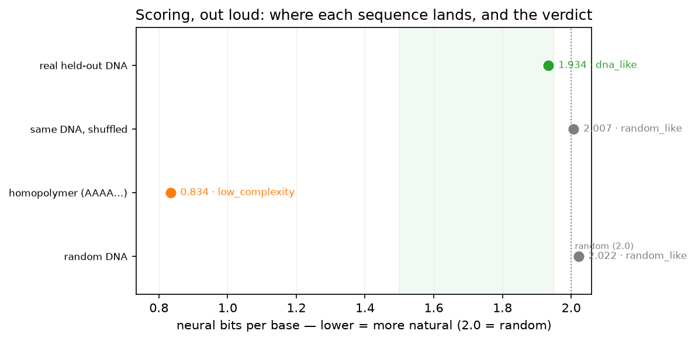

# Scoring, Out Loud

*Part 9 of a series on teaching an AI to read DNA — and the opening of Arc II. For eight posts I built a model that reads DNA and reports a number. This post is the first that gives it a mouth: turning "1.93 bits per base" into a plain-English "yes, that looks like real DNA" — without letting the words say more than the numbers can back up.*

---

Arc I ended with a model that can read DNA, modestly and measurably. But ask it "does this sequence look real?" and it answers **1.934**. That's honest and it's useless to anyone who hasn't spent eight posts learning what a bit per base is. The whole point of this project is a *big* model that handles language calling my *small* one for anything DNA-native — and a specialist that only ever answers in `1.934` is a specialist nobody can talk to.

So Arc II gives the model hands, one tool at a time. This first one is the most human: **say the score out loud.** Turn the number into a verdict — *does this look like real DNA, and how sure are you?*

It sounds like string formatting. It isn't. It's a trap, and walking into it would undo the entire arc.

## The trap: a low number lies in two different ways

The naive version writes itself: low bits = real DNA, high bits = not. Ship it.

Except a low score lies, in two completely different ways, and this series is *about* not getting fooled by a flattering number.

**Lie #1: repetition.** Feed the model `AAAAAAAA…` and it scores it around **0.83 bits** — far "better" than real DNA. By the naive rule, a homopolymer is the most natural DNA imaginable. Obviously it isn't; it's the least. A low score there means *this sequence is boringly predictable*, which is the opposite of the rich, learnable structure that makes real DNA real.

**Lie #2: beating nothing.** Random DNA sits at ~2.0 bits, the "learned nothing" line. But "below 2.0" is a low bar. A sequence can score a bit below random just because its **base composition** is skewed — more G+C than A+T, say — without containing any real biological *grammar* at all. The model knows bacteria are often GC-skewed, so it'll score any GC-skewed noise a little below random. That's not reading DNA; that's counting letters.

A verdict that says "looks like real DNA!" for a homopolymer, or for GC-skewed noise, is exactly the kind of confident, wrong story the guardrails of Arc I existed to catch. So the verdict needs its own guardrails — computed signals, not vibes.

## The honest core: race it against its own shuffle

Guarding Lie #1 is easy: measure **complexity** (how many distinct little k-mers the sequence actually uses) and flag anything dominated by repeats. A homopolymer uses one 3-mer; real DNA uses hundreds. Done.

Lie #2 is the interesting one, and the fix is my favorite idea in this post because it's the whole series' method in miniature. To know whether a low score reflects real *grammar* or just *composition*, I need a control that has the **same composition** but **no grammar**. There's a perfect one sitting right there: **shuffle the sequence.**

Take the DNA, shuffle its letters into a random order, and score *that*. The shuffle has the exact same number of A's, C's, G's, and T's — identical composition, identical GC content — but every trace of biological order is gone. So:

> **grammar_gain = bits(shuffled) − bits(real).** If the model scores the real sequence meaningfully *below* its own shuffle, the bits it saved came from **sequential order** — grammar — not from the letters it happened to contain.

The model judges its own control. No arbitrary threshold, no separate baseline model to argue about — just "do you prefer this exact sequence to a scramble of the same bases?" It's the Markov-baseline logic from Part 2, shrunk to a single sequence and made composition-fair.

(One honest footnote: I shuffle single bases, so the control holds *base* composition fixed but not *dinucleotide* composition. A stricter version preserves neighbor-pair frequencies too. For a laptop-scale plausibility verdict, the mononucleotide shuffle is enough — and I'd rather state the limit than hide it.)

## What it says, out loud

Put the three signals together — complexity, margin below random, and grammar-gain-over-shuffle — and the number becomes a sentence. I ran it on four sequences: a real, **held-out** slice of *M. tuberculosis* (a genome the model never trained on), that same slice shuffled, a homopolymer, and pure random DNA.

| Sequence | bits/bp | its shuffle | grammar gain | verdict |
|---|---|---|---|---|
| real held-out DNA | 1.934 | 2.007 | **+0.073** | **dna_like** |
| same DNA, shuffled | 2.007 | — | ~0 | random_like |
| homopolymer (`AAAA…`) | 0.834 | 0.834 | 0 | low_complexity |
| random DNA | 2.022 | — | ~0 | random_like |

Read that top row out loud: *"Looks like real DNA — the model scores it well below random and below a shuffle of the same bases, so it's reading sequential order, not just base composition."* That's a sentence a frontier model can say to a human. And it's **earned**, not asserted — every number behind it comes back in the payload.

The controls are the satisfying part. **Shuffle the real DNA and the verdict collapses to `random_like`** — same letters, but the model no longer sees anything, because the grammar was in the order and the order is gone. That single comparison is the whole tool working: real 1.934, shuffled 2.007, and the 0.073-bit gap between them is the model quietly saying *"I can tell these apart."* The homopolymer, meanwhile, scores the "best" of all four and is correctly called out as **repetition, not grammar** — Lie #1 and Lie #2 both caught, on camera.

I'll keep my own hype in check: that 0.073-bit margin is real but modest, and the tool flags the below-random gap as *small* rather than pretending it's decisive. This is a laptop model reading a hard, never-seen genome; "dna_like, but only just" is the honest verdict, and the tool says exactly that.

## Why this is a tool, not a feature

Here's the design rule this post is really about, the one the whole third arc will lean on.

The verdict is a **gloss over numbers the tool always returns** — the bits, the shuffle's bits, the margin, the grammar gain, the complexity, the GC. Nothing hides behind the word `dna_like`. If the big model (or a human) doubts the verdict, the receipts are right there. A tool that hands you a confident label and buries the evidence is precisely how you build a system that lies smoothly; a tool that hands you a label *and* the evidence is one you can actually trust to sit between a person and a hard question.

And it respects the boundary this entire project is built on: the frontier model calls `dna_score_report`, gets back a sentence and some scalars, and **speaks** — while never once touching a raw `A`, `C`, `G`, or `T`. Language on one side, DNA on the other, a bounded JSON verdict passing between them. That's the seventh tool on my little specialist, and the first one a person could actually hold a conversation through.

## Where this goes next

The model can now say whether a sequence looks like DNA. The obvious next question — the one from Post 1 — is sharper: not "is this real?" but "I changed *one letter*; did I just break something?" That's Post 10, **The Variant Detective** — turning the model's surprise into a call on which single-base changes matter. The specialist has a voice now. Time to give it an opinion worth asking for.
